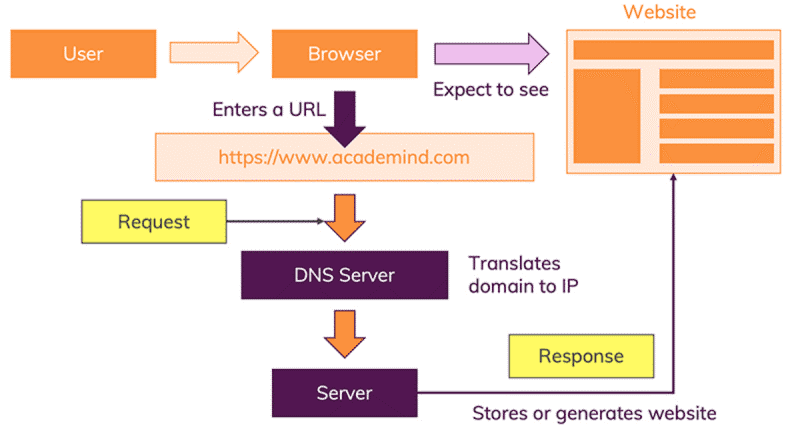
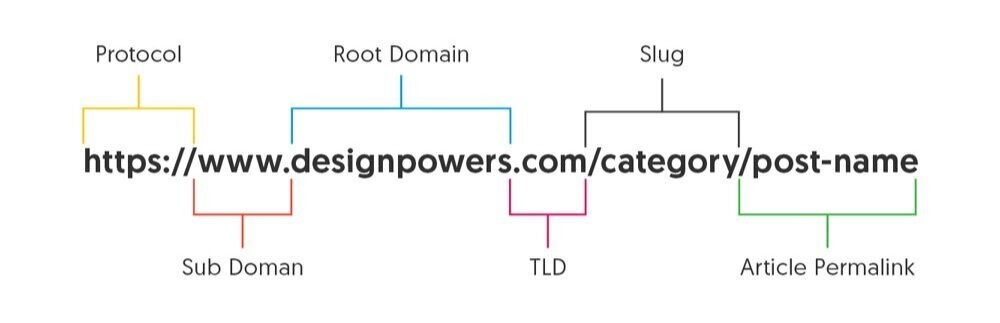
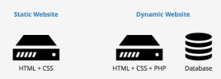

# Web Technology (Introduction) - 3 Day Learning

> Basic Terminologies

1. Web – Interconnected webpages accessible through the Internet.
2. Internet – The Internet is a network, or system, that connects millions of computers worldwide.
3. Client – Any computer hardware or software device that requests access to a service provided by a server.
4. Server – Software and hardware that uses protocols to respond to client requests.
5. Web Browser – Provides a way to look at and interact with all the information on the Web.
6. Webpage - Document from the internet which can be seen with a web browser.
7. Website – Collection of publicly accessible, interlinked Web pages.
8. Web Development – The process of creating and developing web applications

> How Web Works?

When the user opens a browser and enters something like https://www.Google.com, the request goes to one of many special servers on the Internet known as Domain Name Servers (DNS).

The browser goes to the DNS server, and finds the real address of the server that the website lives on: The IP Address.

The browser sends an HTTP request message to the server, asking it to send a copy of the website to the client.

If the server approves the client's request, the server sends a series of small chunks called data packets. The browser assembles the small chunks into a complete web page and displays it to the user.
 

> Types of Servers

Local Servers – Local development occurs on your computer or mobile device. Changes you make won't go live on your site until you upload them, letting you try out bold new building techniques — without worrying that mistakes will break your site.

Dedicated Servers – A dedicated server is a type of web hosting in which a client has the exclusive use of an entire server. The customer has complete control over the machine, so they can optimize it for their unique requirements, including performance and security.
 

> What is URL? And Structure of URL.

A URL (Uniform Resource Locator) is a unique identifier used to locate a resource on the Internet. The URL makes it possible for a computer to locate and open a web page on a different computer on the Internet.

A protocol is a kind of set of rules that describe the sequence, features of interaction between two or more devices connected to the same network and carrying out communication. The protocol is how the browser gets the information about that page. The protocol is followed by the :// characters.

The subdomain is the part of the domain that comes before the main “root” domain. The domain name is the unique address where a website is located.

The top-level domain (TLD) specifies what type of entity your organization registers as on the internet. Slug helps people as well as web crawlers understand which particular section of a webpage, they’re on.

The last part refers to the exact location of a page, post or file.
 

> Static vs Dynamic Website

A static website is one with stable content, where every user sees the exact same thing on each individual page.

<li>Faster page loading speed</li>
<li>Quick creation</li>
<li>Enhanced security</li>
<li>Limited scalability</li>

Dynamic websites give you the ability to customize and personalize website content for a specific user. All of your data and content are organized in a database. Examples: Instagram.

<li>Easily updated</li>
<li>A better user experience</li>
<li>It takes more resources to create</li>

 

> Single Page vs Multiple Page Application

A Single Page Application is an app that works inside a browser and does not require page reloading during use.

<li>Better Speed and Response Time</li> 
<li> Makes A Website Engaging and Unique</li> 
<li> Security Issues</li>

The multi-page design pattern requires a page reload every time the content changes.

<li> Easy to Analyze</li> 
<li> Scalability</li> 
<li> Slower</li> 
<li> Takes More Time to Develop</li>

 
