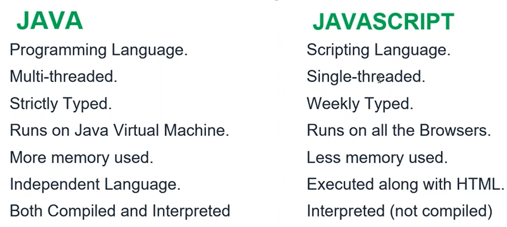

# Day 3 - Web Technology (JS)

## Topics Covered

### <u><i>Introduction to Javascript</i></u>

    

    

A `variable` can be declared using: **var, let and const** keywords.

`Keywords` are reserved words in the programming language.

`Identifiers` is name given to variables by the programmer.

`Literals` is the data stored inside the variable.

> To check the data type - `typeof` Operator is used.

> When we write `1n` it is considered as `big int`

> `null` is also considered as an empty object in JS.

> `Symbol` is considered as function in JS.

### <u><i>Difference Between `var` and `let`</i></u>

`var` is in GLOBAL scope but on the other hand `let` and `const` is in SCRIPT scope.

`var` allows `re declaration` as well but the others does not.

> BUT if `var` is declared inside a function then it has a LOCAL scope.

### <u><i>Operators in Javascript</i></u>
